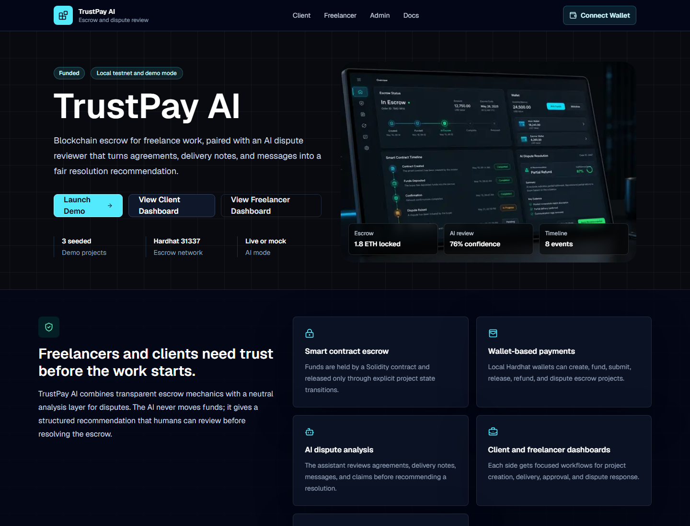
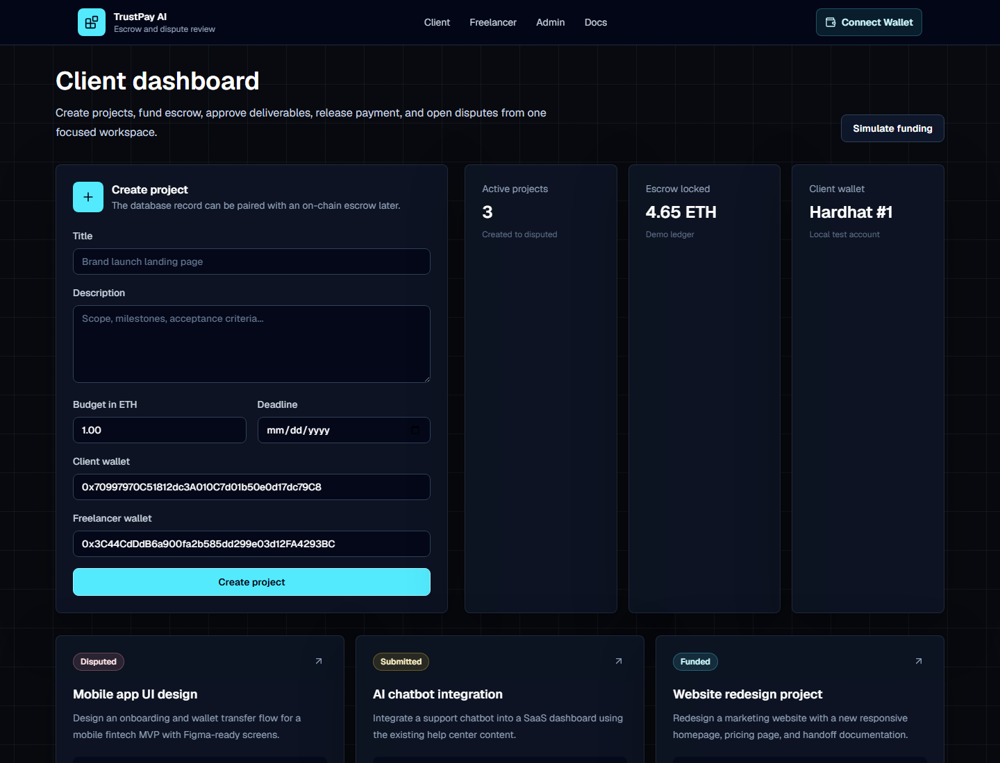
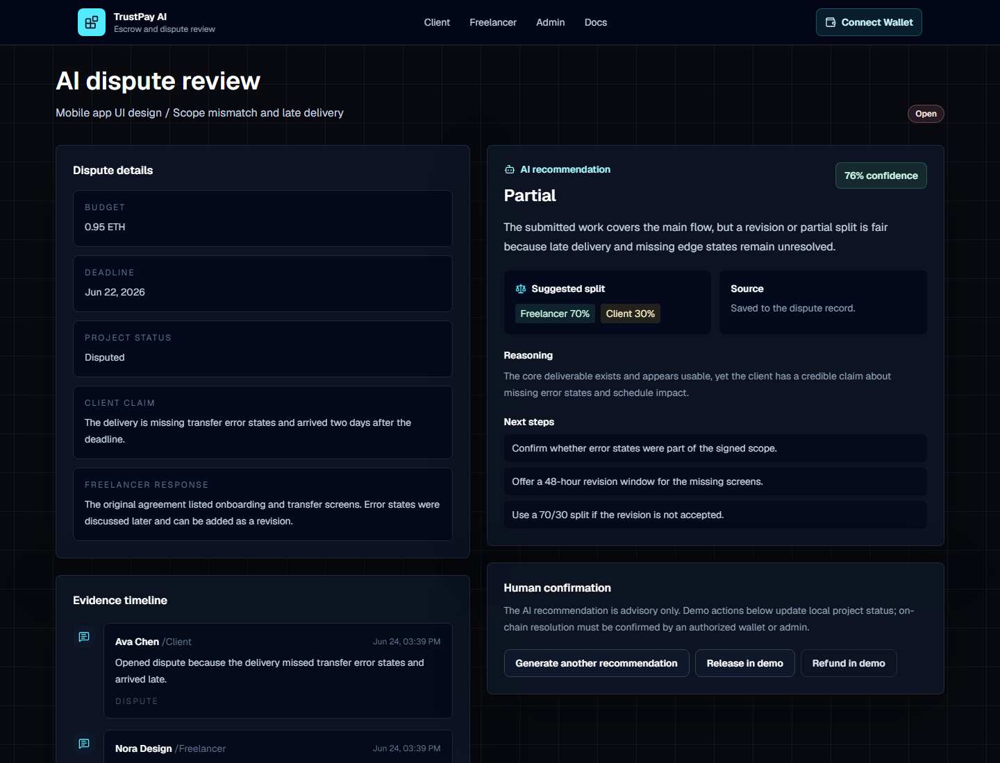
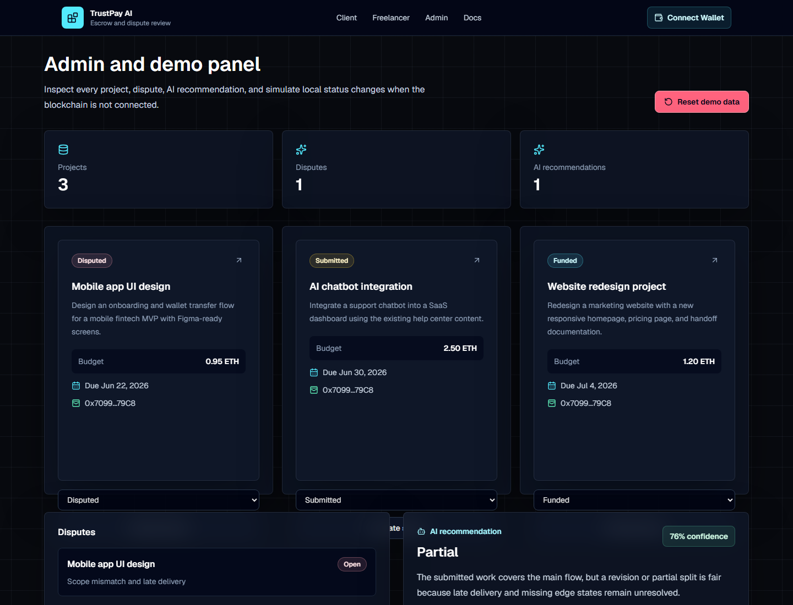

# TrustPay AI

Blockchain escrow platform with AI-powered dispute resolution for freelancers and clients.



## Screenshots

### Client Dashboard



### AI Dispute Review



### Admin Demo Panel



## Portfolio Description

“TrustPay AI is a full-stack blockchain escrow platform for freelancers and clients. It uses Solidity smart contracts to lock and release project payments, while an AI assistant analyzes project agreements, delivery notes, and dispute messages to recommend fair resolutions.”

## What It Does

TrustPay AI demonstrates a realistic SaaS workflow for freelance payments:

- Clients create projects with budget, deadline, and freelancer wallet.
- A local/testnet wallet funds escrow through a Solidity contract.
- Freelancers submit deliverables and notes.
- Clients release payment, refund, or open a dispute.
- The AI assistant reviews project context and recommends release, refund, partial split, or revision.
- Admin/demo tools inspect all projects and simulate status changes when a local chain is not connected.

The AI never moves money. It only recommends a resolution for a human or admin to confirm.

## Tech Stack

- Next.js App Router, TypeScript, Tailwind CSS
- Prisma with SQLite for local development
- Solidity and Hardhat
- wagmi and viem for wallet interactions
- OpenAI API when `OPENAI_API_KEY` is set, realistic mock fallback otherwise
- Vitest for AI service tests
- Hardhat/Chai tests for smart contract behavior

## Architecture

```text
trustpay-ai/
  app/                 Next.js routes, dashboards, API handlers, server actions
  components/          Reusable SaaS UI, wallet controls, project cards
  lib/                 Prisma client, AI analyzer, contract ABI, utilities
  prisma/              SQLite schema and seed script
  contracts/           TrustPayEscrow.sol
  scripts/             Deploy and local database helper scripts
  test/                Hardhat contract tests
  tests/               App/service tests
  public/              Generated hero/dashboard visual asset
```

## Smart Contract

`TrustPayEscrow.sol` supports:

- `createProject`
- `fundProject`
- `submitWork`
- `releasePayment`
- `refundClient`
- `openDispute`
- `resolveDispute`
- `getProject`

It includes custom errors, status transition checks, client/freelancer authorization, dispute resolution split checks, and events for every major escrow action.

## AI Dispute Assistant

The analyzer accepts:

- Project description
- Budget and deadline
- Delivery notes
- Client dispute reason
- Freelancer response
- Timeline/messages

It returns:

```json
{
  "recommendation": "release | refund | partial | revise",
  "confidence": 0.76,
  "summary": "...",
  "reasoning": "...",
  "suggestedFreelancerPercent": 70,
  "suggestedClientRefundPercent": 30,
  "nextSteps": ["...", "..."]
}
```

If `OPENAI_API_KEY` is missing, TrustPay AI uses a keyword-aware mock recommendation so the full demo still works.

## Local Setup

```bash
npm install
npm run db:push
npm run db:seed
npm run dev
```

Open `http://localhost:3000`.

## Environment Variables

Copy `.env.example` to `.env.local` or update `.env`:

```env
DATABASE_URL="file:./dev.db"
OPENAI_API_KEY=""
NEXT_PUBLIC_ESCROW_CONTRACT_ADDRESS=""
NEXT_PUBLIC_CHAIN_ID="31337"
NEXT_PUBLIC_WALLETCONNECT_PROJECT_ID=""
```

## Commands

```bash
npm run dev
npm run build
npm run lint
npm run test
npm run db:push
npm run db:seed
npm run chain
npm run contract:compile
npm run contract:test
npm run contract:deploy:local
```

## Demo Flow

1. Run `npm run db:seed`.
2. Visit `/dashboard/client` to create or inspect projects.
3. Visit `/dashboard/freelancer` to submit deliverables.
4. Open a project at `/projects/[id]`.
5. Open a dispute or visit `/dispute/[projectId]`.
6. Save an AI recommendation.
7. Use `/admin` to inspect projects, disputes, recommendations, and simulate status changes.

Seeded projects:

- Website redesign project, funded
- AI chatbot integration, submitted
- Mobile app UI design, disputed

## Local Blockchain Flow

```bash
npm run chain
npm run contract:deploy:local
```

Copy the deployed contract address into:

```env
NEXT_PUBLIC_ESCROW_CONTRACT_ADDRESS="0x..."
NEXT_PUBLIC_CHAIN_ID="31337"
```

Restart `npm run dev`, connect a local wallet, and use project blockchain actions to create/fund/submit/release/dispute escrow records on the Hardhat chain.

## Testing

```bash
npm run lint
npm run build
npm run test
npm run contract:test
```

Current coverage includes:

- Contract creation and funding
- Freelancer work submission
- Client release and refund flows
- Dispute opening and split resolution
- Unauthorized action failures
- AI mock recommendation heuristics

## Future Improvements

- Persist parsed on-chain event IDs after escrow creation.
- Add role-based authentication.
- Add file uploads for deliverable evidence.
- Add notifications for milestone and dispute events.
- Add a richer arbitrator/admin workflow for partial on-chain split confirmation.
- Deploy to a public testnet with block explorer links.

## Security Note

This project is for portfolio/demo use on local Hardhat or testnets only. Do not use mainnet funds or real client payments without a full security audit, production authentication, monitoring, and legal review.
